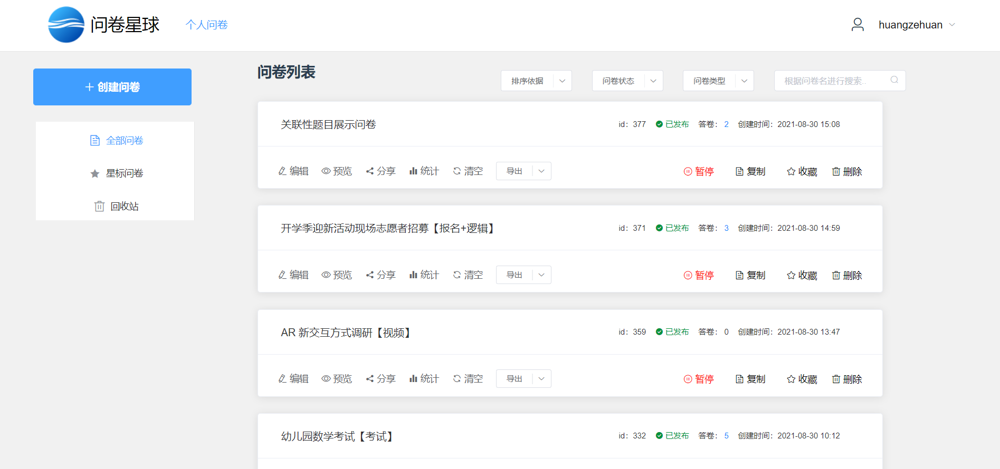
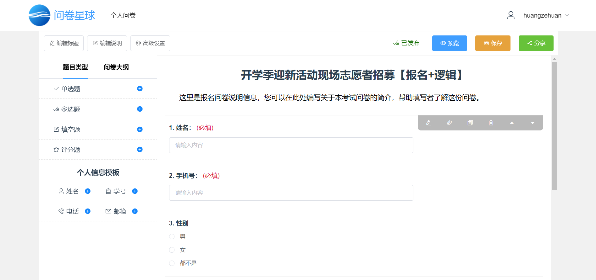
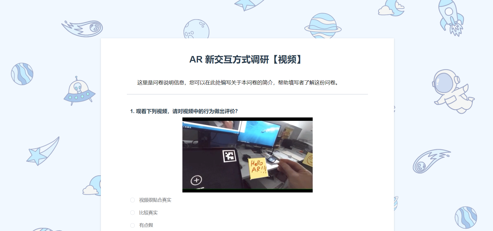
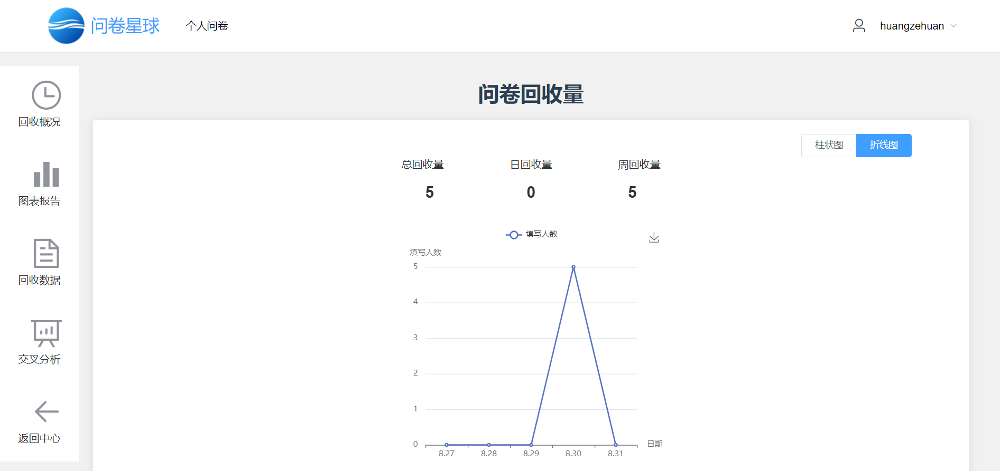

# 问卷星球

[](https://cn.vuejs.org/) [](https://cli.vuejs.org/)

> 北航 1921 软件工程暑期实践 满分项目 ~~万一有更多star呢~~

后端：[https://github.com/BUAASE-Slime/Questionnaire-Planet-Django](https://github.com/BUAASE-Slime/Questionnaire-Planet-Django)

## 项目介绍

问卷星球，问卷发布平台，实现了含普通问卷、考试问卷、报名问卷、投票问卷、疫情打卡问卷等五类问卷的创建、编辑、发布、统计功能。

项目突出特点有：

- 友好的问卷制作界面：空白问卷模板、大纲题目可拖拽编辑题目顺序、编辑问卷时每隔1分钟自动保存
- 特别问卷的展示与设计： 
    - 考试问卷显示**截止时间倒计时、且题目乱序展示**； 
    - 投票、考试问卷填报完成后展示答题反馈；
    - 疫情打卡可获取用户IP地址；
    - 报名问卷剩余名额的实时反馈，以及同步提交的数据库事务处理
- 完整实用的数据统计分析（含**图表分析与交叉分析**）
- 各类问卷与数据导出文件的DIY设计
- **逻辑关联问题**设计
- 支持上传**图片和视频**

## 如何使用

> 须结合 [后端说明](https://github.com/BFlameSwift/Questionnaire-Planet-Django) 进行配置

运行项目前，请根据文件内容提示修改 **/src/GlobalInfo.js**，其中包含前端路由 `baseUrl`、后端路由 `backUrl`、后端公共路由 `publicBackUrl`。

本地运行项目，会执行 **vue.config.js** 的设置信息，请如需按提示修改该文件。

接下来安装运行项目：

```shell
npm install
npm run serve
```

需要部署时，运行：

```shell
npm run build
```

## 基本页面展示

欢迎主页


管理中心



编辑界面



填写界面



统计界面


